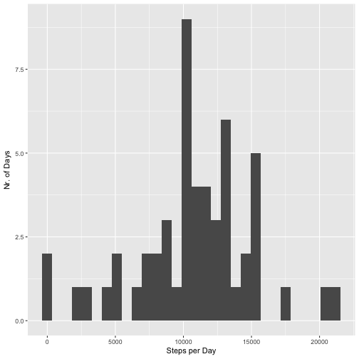
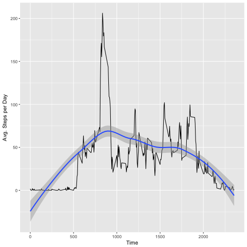
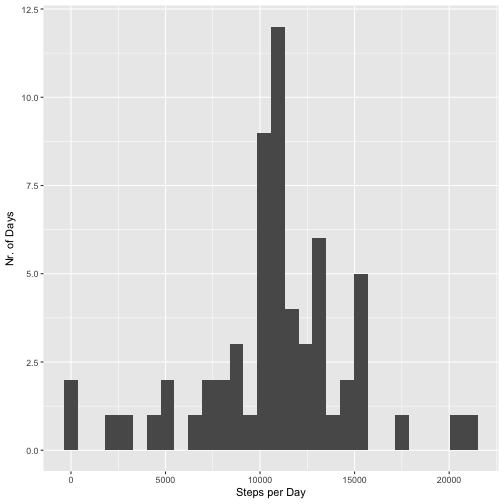
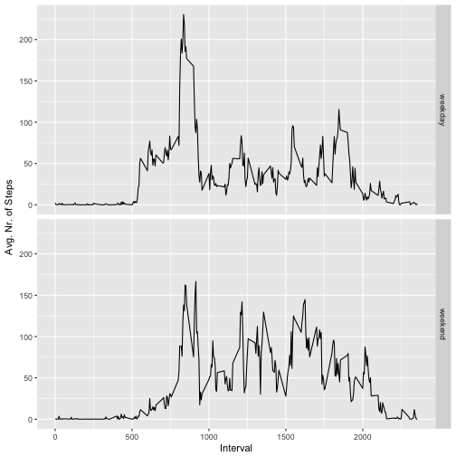

### Preliminary Steps
Set knitr and R options

```r
knitr::opts_chunk$set(echo = TRUE, message = FALSE, warning = FALSE)
options(digits = 2)
```
Load necessary packages


```r
library(dplyr)
library(ggplot2)
```

Unzip and read the data

```r
unzip(zipfile="repdata%2Fdata%2Factivity.zip")  
dat <- read.csv("activity.csv")
```
### Plot histogram before imputing missing values
Compute sum of steps by day and plot histogram

```r
dat1 <- dat %>% group_by(date) %>% summarize(sumstepsbyday = sum(steps))
ggplot(dat1, aes(sumstepsbyday)) + geom_histogram() + xlab("Steps per Day") + ylab("Nr. of Days")
```



### Mean and Median
Compute the avg. nr. of steps and the median sum of steps per day

```r
mean_raw <- mean(dat1$sumstepsbyday, na.rm = TRUE)
median_raw <- median(dat1$sumstepsbyday, na.rm = TRUE)
mean_raw
```

```
## [1] 10766
```

```r
median_raw
```

```
## [1] 10765
```
### Plot time series of activity
Compute the avg. nr. of steps per day and plot as time series

```r
dat2 <- dat %>% group_by(interval) %>% summarize(avgstepsbyday = mean(steps, na.rm = TRUE))
ggplot(dat2, aes(x = interval, y = avgstepsbyday, group = 1)) +
        geom_line() + geom_smooth() + xlab("Time") + ylab("Avg. Steps per Day")
```



### Retrieving the interval with most activity 
Get the row with the max avg. nr. of steps

```r
maxactiveinterval <- dat2[which.max(dat2$avgstepsbyday), ]
maxactiveinterval
```

```
## # A tibble: 1 x 2
##   interval avgstepsbyday
##      <int>         <dbl>
## 1      835           206
```
The interval with most activity is 835 with 206.17 average steps per day.

### Count nr. of rows with NA

```r
na_count <- sum(is.na(dat$steps))
na_count
```

```
## [1] 2304
```
There are 2304 rows with missing values.

### Imputing missing values 
Replace NA with average steps of corresponding interval of other days

```r
dat3 <- dat %>%
        group_by(interval) %>% 
        mutate_each(funs(replace(., which(is.na(.)),
                                 mean(., na.rm = TRUE))))
```

### Plot histogram after imputing missing values
Compute the sum of steps per day and plot histogram after missing data treatment

```r
dat4 <- dat3 %>% group_by(date) %>% summarize(sumstepsbyday = sum(steps))
ggplot(dat4, aes(sumstepsbyday)) + geom_histogram() + xlab("Steps per Day") + ylab("Nr. of Days")
```



### Compute the avg. nr. of steps and the median nr. of steps per day after missing data treatment

```r
dat5 <- dat3 %>% group_by(date) %>% summarize(sumstepsbyday = sum(steps))
mean_clean <- mean(dat5$sumstepsbyday, na.rm = TRUE)
median_clean <- median(dat5$sumstepsbyday, na.rm = TRUE)
mean_clean
```

```
## [1] 10766
```

```r
median_clean
```

```
## [1] 10766
```
The mean didnt' change since we imputed the missing data with mean values of all other days. The median has, however, changed slighlty: From 1.08 &times; 10<sup>4</sup>(before missing data treatment) to 1.08 &times; 10<sup>4</sup>(after treatment).

### Plot time series panel by weekday
Convert "date" to date format

```r
dat3$date <- as.Date(dat3$date)
```

Compute dummy variable for weekday and weekend

```r
dat3$weekday <- ifelse(weekdays(dat3$date) == "Samstag" | weekdays(dat3$date) == "Sonntag",
                       "weekend", "weekday")
```

Compute avg. nr. of steps per interval and weekday and plot as time series per weekday (panel) 

```r
dat6 <- dat3 %>% group_by(weekday, interval) %>% summarize(avgbyweekday = mean(steps))
ggplot(dat6, aes(interval, avgbyweekday)) + geom_line() + facet_grid(weekday ~.) + 
        xlab("Interval") + ylab("Avg. Nr. of Steps")
```




